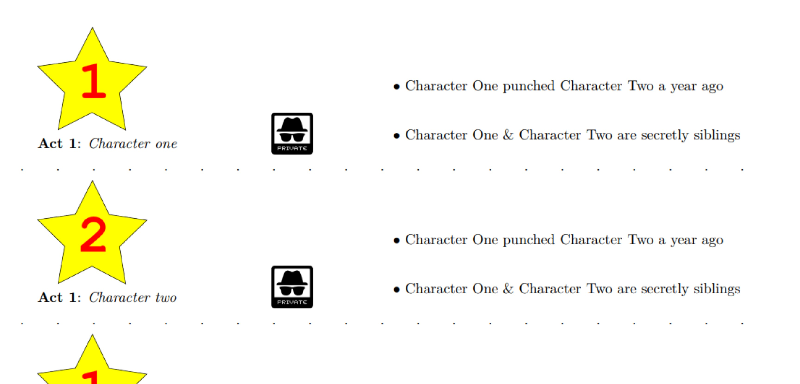
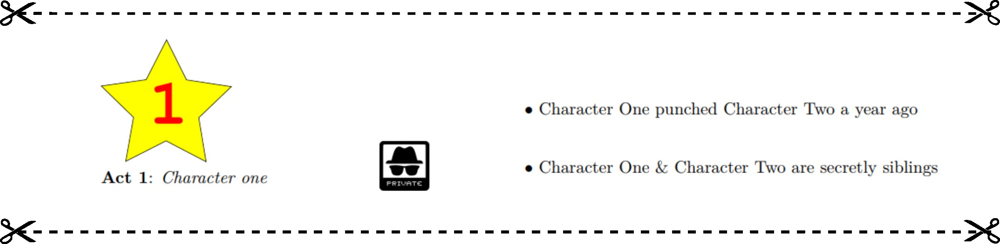
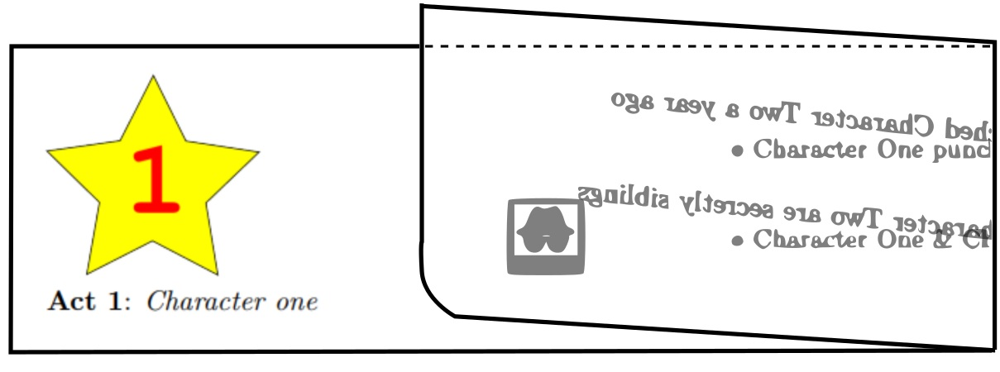

## Summary

This program creates printable documents, intended to be used in Murder Mystery (MM) parties that I have thrown annually for several years.  The pages generated by this program have cut lines to indicate where to cut, and require a LaTeX package to generate.

After the documentation is printed out  it is then cut  and folded  to hide a character's information from other players.  These folded cutouts are then handed to players at the beginning of each act.

See [example game](https://github.com/williamweatherholtz/murder-mystery-skeleton/blob/main/murder_mystery_example.py) in the skeleton template repository for a more thorough use case example.

## Background

The MM parties I throw have several acts, and many plot points which are revealed in succession through the acts.  Normally there are 16 or so unique characters, each with 3-4 plot points revealed each act for all 3 acts.  In this typical example, that makes between 144 and 192 plot points that need to be carefully managed without mistake. At the end of the game there is usually some kind of escape-room style puzzles.  

All this to say there are a lot of moving parts, and this document printing system is a way to handle printing out the information tied to each character for each act.  It is designed in a way that is easy to modify and create for me, as it's also normal for a character or two to drop out last minute, whose plot points are usually inherited by another character so the plot retains continuity.

This repository is intended to be used as a submodule, or similar, in a main design file [see murder mystery skeleton template](https://github.com/williamweatherholtz/murder-mystery-skeleton).  Furthermore, LaTeX, the typesetting engine used in this project is a bit... old and doesn't handle importing all kinds of data from various places gracefully.  Which is to say - don't change the structure of the skeleton repository unless you understand what you're doing.  Many of the references to the LaTeX class that provides relevant macros are hardcoded, as there was no other remotely elegant solution I found.
